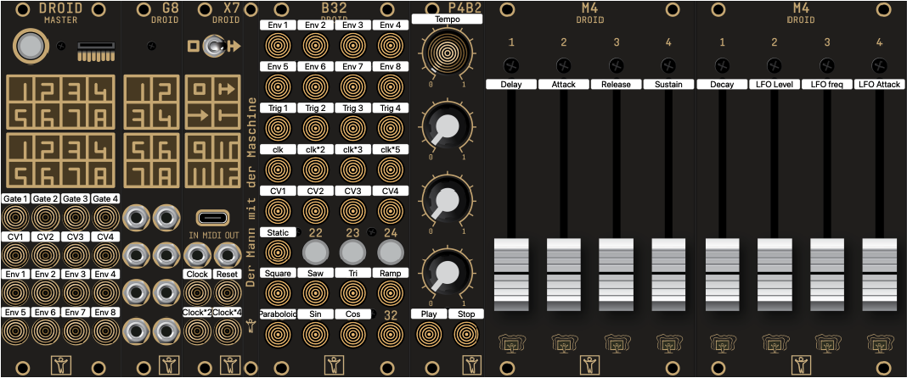

# droid_oct_envelope
octuple complex envelope with 4 triggers 

# How to use it

- Select which envelope you wish to adjust with the buttons Env1 ... Env8
- Select what triggers the selected envelope
    - Trig1 ... Trig4 are the the gates inputs of the Droid
    - clk ... clk*5 are the clock and its multiple frequencies
- Select the parameters of the envelope
    - Static is the default parameters
    - CV1 ... CV4 is the influence of the CV input on the parameters
    - The slider set the individual parameters or the CV influence
- In addition to traditional ADSR envelopes, one can blend a lfo with the envelope
    - select the shape of the LFA with the buttons Square ... Cos
    - The parameter LFO level define the amplitude of the LFO
    - LFO freq defines the frequency of the envelope
    - LFO attach defines how fast the envelope is blended into the signal.
- The clocks are controled with
    - Tempo pot to adjust the speed
    - Play to let the clock run
    - Stop that stops the clock, while the button is pressed down it also pull the Reset output high